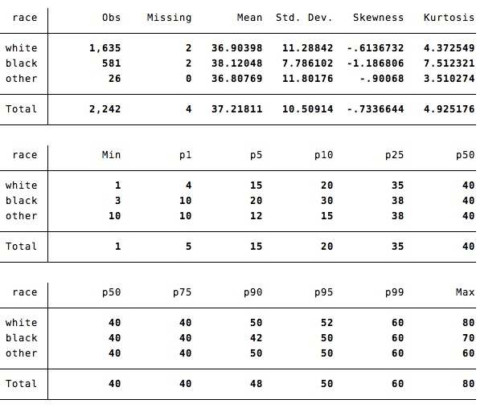
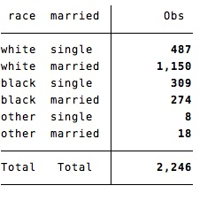

The command `stat` prints summary statistics by groups. 

### `stat` can `summarize` by groups

```
sysuse nlsw88.dta, clear
stat hours, by(race) 
```


You can compute more statistics with the option `detail`:
```
stat hours, by(race) detail
```



### `stat` accepts any statistics

```
stat hours, by(race)  s(mean p80)
```


The list of allowed statistics is:

Name | Definition
---|---
mean          | mean
count         | count of nonmissing observations
n             | same as count
sum           | sum
max           | maximum
min           | minimum
range         | range = max - min
sd            | standard deviation
variance      | variance
cv            | coefficient of variation (sd/mean)
semean        | standard error of mean (sd/sqrt(n))
skewness      | skewness
kurtosis      | kurtosis
median        | median (same as p50)
iqr           | interquartile range = p75 - p25
q             | equivalent to specifying p25 p50 p75
nmissing	|	Number of missing observations
p??			|	any ??th percentile


### `stat` accepts groups defined by  multiple variables

```
stat hours, by(race married) s(m)
```



### `stat`can `collapse` to an external dataset

```
stat hours wage , by(race married) s(mean p50 p90) output(temp.dta)
describe using temp.dta
```


### `stat` is fast
`stat` is faster than `tabulate`, `table, contents`, `tabstat`, or `collapse`


# fasttabstat

The command `fasttabstat` is a drop-in version of `tabstat`, with two advantages:
- `fasttabstat`  is 10x faster than `tabstat`.
- `fasttabstat` accepts more statistics than `tabstat` : 
	- any percentile 
	- `nmissing` : number of missing observations.

