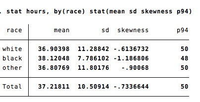

# fasttabstat

The command `fasttabstat` is an better version of `tabstat`. While its syntax is exactly the same than `tabstat`, `fasttabstat` has two advantages
- `fasttabstat`  is 10x faster than `tabstat`  (by borrowing the Mata function `characterize_unique_vals_sorted` from `binscatter`)
- `fasttabstat` accepts more statistics: any percentile + the number of missing observations


# stat
The command `stat` is a wrapper for `fastabstat` that behaves more similarly to `summarize` 
-  When `statistics` is not specified, it computes the same statistics than `summarize` (the option `detail` is llowed)
- It returns a list of scalar of the form `statname_byvalue`

```
sysuse nlsw88.dta, clear
stat hours, by(race) 
```


Alternatively, a list of statistics can be specified:
```
sysuse nlsw88.dta, clear
stat hours, by(race) stat(mean sd skewness p94)
```



# List of allowed statistics

For both commands, the list of allowed statistics is:

Name | Definition
---|---
mean          | mean
count         | count of nonmissing observations
n             | same as count
sum           | sum
max           | maximum
min           | minimum
range         | range = max - min
sd            | standard deviation
variance      | variance
cv            | coefficient of variation (sd/mean)
semean        | standard error of mean (sd/sqrt(n))
skewness      | skewness
kurtosis      | kurtosis
p??			|	??th percentile
median        | median (same as p50)
iqr           | interquartile range = p75 - p25
q             | equivalent to specifying p25 p50 p75
detail			| count mean min max sd skewness kurtosis p1 p5 p10 p25 p50 p75 p90 p95 - p99 max

