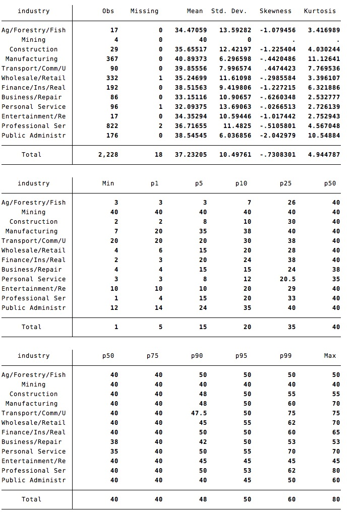
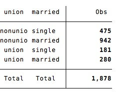
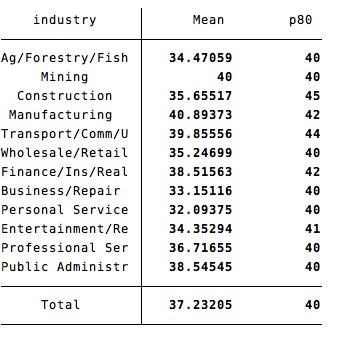
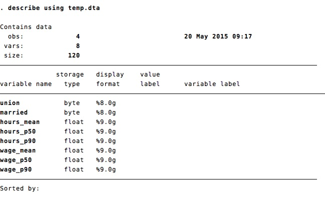

### `sumup`  = `summarize` by group

By default, `sumup` returns the same set of statistics than `summarize` 

```
sysuse nlsw88.dta, clear
sumup hours, by(race) 
```


With the option `detail`, `sumup` returns detailed statistics:
```
sumup hours, by(industry) detail
```



### `sumup` accepts groups defined by several variables:

`sumup` computes summary statistics for groups defined by multiple variables:

```
sumup hours, by(union married) 
```


This is both faster and simpler than using `group` in a first step

This makes `sumup` a useful extension of `tabulate`:

```
sumup, by(union married) 
```



### `sumup` is flexible

The option `statistics` allows to specify a set of statistics:
```
sumup hours, by(industry) statistics(mean p80)
```



The list of allowed statistics is the following:

Name | Definition
---|---
mean          | mean
count         | count of nonmissing observations
n             | same as count
missing	|	Number of missing observations
sum           | sum
max           | maximum
min           | minimum
range         | range = max - min
sd            | standard deviation
variance      | variance
cv            | coefficient of variation (sd/mean)
semean        | standard error of mean (sd/sqrt(n))
skewness      | skewness
kurtosis      | kurtosis
median        | median (same as p50)
iqr           | interquartile range = p75 - p25
q             | equivalent to specifying p25 p50 p75
p??			|	any ??th percentile


Instead of returning a set of scalars, sumup returns matrices.


### `sumup` can `collapse` to an external dataset

You can replace the existing dataset by the summary statistics using the `collapse` option
```
sumup hours wage, by(union married) statistics(mean p50 p90) collapse
```


To avoid erasing the original dataset, save the summary statistics  dataset through the `save` option:

```
sumup hours wage, by(union married) statistics(mean p50 p90) save(temp.dta) replace
```



### `sumup` is fast
`sumup` is ten times faster than `table, contents()`, `tabstat` or `collapse`. `sumup` is as fast, but more flexible, than `tabulate, summarize()`.


# Installation
```
net install sumup, from(https://github.com/matthieugomez/stata-sumup/raw/master/)
```

# Reference
`sum_up` borrows heavily  from `tabstat`.  The package also includes the command `fasttabstat` which is a drop in, faster version of `tabstat`. The tabstat command was written by Jeroen Weesie and Vincent Buskens both of the Department of Sociology at Utrecht University, The Netherlands.

